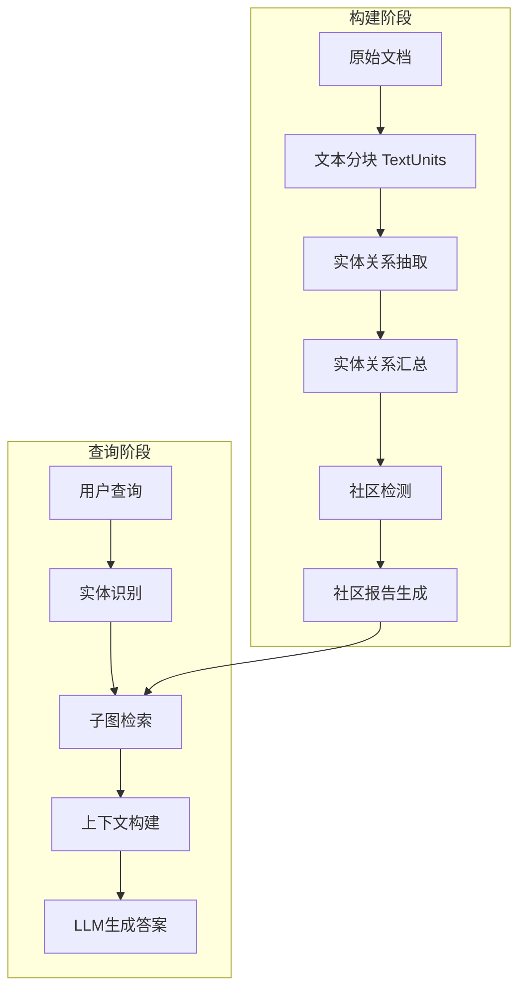

# GraphRAG Token优化改进方案

## 项目背景

本方案针对Microsoft GraphRAG框架提出两项核心优化，旨在显著降低Token消耗量：

1. **知识图谱构建阶段**：通过动态Token限制策略优化LLM API调用
2. **检索增强生成阶段**：通过子图关联性预裁剪减少输入信息量

## 一、项目架构分析

### 1.1 核心数据流



### 1.2 关键代码路径

#### 构建阶段关键文件
- [`graphrag/index/operations/extract_graph/graph_extractor.py`](../graphrag/index/operations/extract_graph/graph_extractor.py) - 图抽取核心逻辑
- [`graphrag/index/operations/extract_graph/graph_intelligence_strategy.py`](../graphrag/index/operations/extract_graph/graph_intelligence_strategy.py) - 抽取策略
- [`graphrag/index/text_splitting/text_splitting.py`](../graphrag/index/text_splitting/text_splitting.py) - 文本分块
- [`graphrag/config/models/extract_graph_config.py`](../graphrag/config/models/extract_graph_config.py) - 抽取配置

#### 查询阶段关键文件
- [`graphrag/query/structured_search/local_search/search.py`](../graphrag/query/structured_search/local_search/search.py) - 本地搜索
- [`graphrag/query/structured_search/global_search/search.py`](../graphrag/query/structured_search/global_search/search.py) - 全局搜索
- [`graphrag/query/context_builder/local_context.py`](../graphrag/query/context_builder/local_context.py) - 上下文构建
- [`graphrag/query/context_builder/builders.py`](../graphrag/query/context_builder/builders.py) - 构建器基类

## 二、优化方案一：知识图谱构建阶段Token优化

### 2.1 问题分析

当前实现中，图抽取阶段存在以下Token消耗问题：

1. **固定chunk_size**：默认300 tokens，不考虑文本复杂度
2. **固定max_gleanings**：默认1次补充抽取，不考虑内容密度
3. **无自适应机制**：所有文本单元使用相同的Token配额
4. **缺少预估机制**：无法根据文本特征预测所需Token量

### 2.2 优化策略设计

#### 策略1：文本复杂度自适应Token分配

**核心思想**：根据文本特征动态调整max_tokens参数

**实现方案**：

```python
# 新增文件：graphrag/index/operations/extract_graph/token_optimizer.py

class TokenOptimizer:
    """动态Token优化器"""
    
    def calculate_complexity_score(self, text: str) -> float:
        """计算文本复杂度分数 (0-1)"""
        # 因素1: 实体密度（命名实体数量/总词数）
        # 因素2: 句子复杂度（平均句子长度）
        # 因素3: 词汇多样性（unique words / total words）
        # 因素4: 专业术语密度
        pass
    
    def estimate_optimal_tokens(
        self, 
        text: str, 
        base_tokens: int = 4000,
        min_tokens: int = 2000,
        max_tokens: int = 8000
    ) -> int:
        """估算最优Token数量"""
        complexity = self.calculate_complexity_score(text)
        # 复杂度越高，分配更多tokens
        optimal = base_tokens + (max_tokens - base_tokens) * complexity
        return int(max(min_tokens, min(optimal, max_tokens)))
```

#### 策略2：分层Token预算管理

**核心思想**：为不同类型的文本单元设置不同的Token预算

```python
class TokenBudgetManager:
    """Token预算管理器"""
    
    def __init__(self, total_budget: int):
        self.total_budget = total_budget
        self.used_budget = 0
        self.priority_queue = []  # 优先级队列
    
    def allocate_tokens(self, text_units: list) -> dict:
        """为文本单元分配Token预算"""
        # 1. 计算每个单元的重要性分数
        # 2. 按重要性排序
        # 3. 优先为重要单元分配更多tokens
        # 4. 确保总预算不超标
        pass
```

#### 策略3：渐进式抽取策略

**核心思想**：先用少量tokens进行初步抽取，根据结果决定是否需要更多tokens

```python
class ProgressiveExtractor:
    """渐进式抽取器"""
    
    async def extract_with_progressive_tokens(
        self,
        text: str,
        initial_tokens: int = 2000,
        max_tokens: int = 8000,
        quality_threshold: float = 0.8
    ):
        """渐进式Token分配抽取"""
        current_tokens = initial_tokens
        
        while current_tokens <= max_tokens:
            result = await self.extract(text, max_tokens=current_tokens)
            quality = self.evaluate_extraction_quality(result)
            
            if quality >= quality_threshold:
                return result  # 质量足够，停止
            
            # 质量不足，增加tokens重试
            current_tokens = min(current_tokens * 1.5, max_tokens)
        
        return result
```

### 2.3 实现要点

#### 修改点1：GraphExtractor类增强

**文件**：[`graphrag/index/operations/extract_graph/graph_extractor.py`](../graphrag/index/operations/extract_graph/graph_extractor.py:41)

```python
class GraphExtractor:
    def __init__(
        self,
        model_invoker: ChatModel,
        # ... 现有参数 ...
        token_optimizer: TokenOptimizer | None = None,  # 新增
        enable_adaptive_tokens: bool = True,  # 新增
    ):
        self._token_optimizer = token_optimizer or TokenOptimizer()
        self._enable_adaptive_tokens = enable_adaptive_tokens
    
    async def _process_document(
        self, 
        text: str, 
        prompt_variables: dict[str, str]
    ) -> str:
        # 动态计算max_tokens
        if self._enable_adaptive_tokens:
            optimal_tokens = self._token_optimizer.estimate_optimal_tokens(text)
            model_params = {"max_tokens": optimal_tokens}
        else:
            model_params = {}
        
        response = await self._model.achat(
            self._extraction_prompt.format(**{
                **prompt_variables,
                self._input_text_key: text,
            }),
            model_parameters=model_params  # 传递动态参数
        )
        # ... 后续处理 ...
```

#### 修改点2：配置文件扩展

**文件**：[`graphrag/config/models/extract_graph_config.py`](../graphrag/config/models/extract_graph_config.py:14)

```python
class ExtractGraphConfig(BaseModel):
    # ... 现有字段 ...
    
    # 新增Token优化配置
    enable_adaptive_tokens: bool = Field(
        description="启用自适应Token分配",
        default=True,
    )
    base_max_tokens: int = Field(
        description="基础max_tokens值",
        default=4000,
    )
    min_max_tokens: int = Field(
        description="最小max_tokens值",
        default=2000,
    )
    max_max_tokens: int = Field(
        description="最大max_tokens值",
        default=8000,
    )
    token_budget_per_batch: int | None = Field(
        description="每批次的Token总预算（可选）",
        default=None,
    )
```

#### 修改点3：添加Token使用统计

**新增文件**：`graphrag/index/operations/extract_graph/token_stats.py`

```python
@dataclass
class TokenUsageStats:
    """Token使用统计"""
    total_prompt_tokens: int = 0
    total_completion_tokens: int = 0
    total_cost: float = 0.0
    text_units_processed: int = 0
    average_tokens_per_unit: float = 0.0
    tokens_saved: int = 0  # 相比固定策略节省的tokens
    
    def update(self, prompt_tokens: int, completion_tokens: int):
        """更新统计信息"""
        self.total_prompt_tokens += prompt_tokens
        self.total_completion_tokens += completion_tokens
        self.text_units_processed += 1
        # ... 更新其他字段 ...
```

## 三、优化方案二：检索增强生成阶段子图预裁剪

### 3.1 问题分析

当前查询阶段存在以下问题：

1. **检索召回过多**：Local Search可能检索大量相关实体和关系
2. **无关联性评分**：所有召回的子图元素同等对待
3. **上下文冗余**：包含许多与查询弱相关的信息
4. **Token浪费**：大量tokens用于传输低价值信息

### 3.2 优化策略设计

#### 策略1：轻量级关联性评分模型

**核心思想**：使用轻量级模型对召回的子图元素进行关联性打分

**实现方案**：

```python
# 新增文件：graphrag/query/context_builder/relevance_scorer.py

class RelevanceScorer:
    """子图关联性评分器"""
    
    def __init__(
        self,
        scoring_method: str = "embedding",  # embedding, lightweight_llm, hybrid
        embedding_model: str = "text-embedding-3-small",
        score_threshold: float = 0.6
    ):
        self.scoring_method = scoring_method
        self.embedding_model = embedding_model
        self.score_threshold = score_threshold
    
    async def score_entities(
        self, 
        query: str, 
        entities: list[Entity]
    ) -> list[tuple[Entity, float]]:
        """为实体列表打分"""
        if self.scoring_method == "embedding":
            return await self._score_by_embedding(query, entities)
        elif self.scoring_method == "lightweight_llm":
            return await self._score_by_lightweight_llm(query, entities)
        else:
            return await self._score_hybrid(query, entities)
    
    async def _score_by_embedding(
        self, 
        query: str, 
        entities: list[Entity]
    ) -> list[tuple[Entity, float]]:
        """基于Embedding相似度打分"""
        # 1. 获取query的embedding
        query_embedding = await self.get_embedding(query)
        
        # 2. 计算每个实体的相似度
        scored_entities = []
        for entity in entities:
            # 使用实体描述的embedding
            entity_text = f"{entity.title}: {entity.description}"
            entity_embedding = await self.get_embedding(entity_text)
            similarity = cosine_similarity(query_embedding, entity_embedding)
            scored_entities.append((entity, similarity))
        
        return scored_entities
    
    async def _score_by_lightweight_llm(
        self,
        query: str,
        entities: list[Entity]
    ) -> list[tuple[Entity, float]]:
        """使用轻量级LLM打分（如GPT-3.5-turbo）"""
        # 批量评分以提高效率
        batch_size = 10
        scored_entities = []
        
        for i in range(0, len(entities), batch_size):
            batch = entities[i:i+batch_size]
            scores = await self._batch_score_with_llm(query, batch)
            scored_entities.extend(zip(batch, scores))
        
        return scored_entities
```

#### 策略2：多层级裁剪策略

**核心思想**：根据不同的关联性阈值进行多层级裁剪

```python
class MultiLevelPruner:
    """多层级子图裁剪器"""
    
    def __init__(
        self,
        high_relevance_threshold: float = 0.8,
        medium_relevance_threshold: float = 0.6,
        low_relevance_threshold: float = 0.4
    ):
        self.thresholds = {
            "high": high_relevance_threshold,
            "medium": medium_relevance_threshold,
            "low": low_relevance_threshold
        }
    
    def prune_subgraph(
        self,
        scored_entities: list[tuple[Entity, float]],
        scored_relationships: list[tuple[Relationship, float]],
        max_context_tokens: int,
        tokenizer: Tokenizer
    ) -> tuple[list[Entity], list[Relationship]]:
        """多层级裁剪子图"""
        # 1. 优先保留高相关性元素
        high_entities = [e for e, s in scored_entities if s >= self.thresholds["high"]]
        high_rels = [r for r, s in scored_relationships if s >= self.thresholds["high"]]
        
        # 2. 计算当前token使用量
        current_tokens = self._estimate_tokens(high_entities, high_rels, tokenizer)
        
        # 3. 如果还有空间，添加中等相关性元素
        if current_tokens < max_context_tokens * 0.7:
            medium_entities = [e for e, s in scored_entities 
                             if self.thresholds["medium"] <= s < self.thresholds["high"]]
            medium_rels = [r for r, s in scored_relationships 
                          if self.thresholds["medium"] <= s < self.thresholds["high"]]
            
            # 逐个添加直到达到token限制
            for entity in medium_entities:
                if current_tokens >= max_context_tokens * 0.9:
                    break
                high_entities.append(entity)
                current_tokens = self._estimate_tokens(high_entities, high_rels, tokenizer)
        
        return high_entities, high_rels
```

#### 策略3：图结构感知裁剪

**核心思想**：考虑图的拓扑结构，保留关键路径和桥接节点

```python
class GraphAwarePruner:
    """图结构感知裁剪器"""
    
    def prune_with_graph_structure(
        self,
        entities: list[Entity],
        relationships: list[Relationship],
        query_entities: list[str],  # 查询中识别的实体
        max_hops: int = 2
    ) -> tuple[list[Entity], list[Relationship]]:
        """基于图结构的智能裁剪"""
        # 1. 构建NetworkX图
        G = self._build_graph(entities, relationships)
        
        # 2. 找到查询实体在图中的节点
        query_nodes = [n for n in G.nodes() if n in query_entities]
        
        # 3. 提取以查询实体为中心的k-hop子图
        subgraph_nodes = set()
        for node in query_nodes:
            # 获取k-hop邻居
            neighbors = nx.single_source_shortest_path_length(
                G, node, cutoff=max_hops
            )
            subgraph_nodes.update(neighbors.keys())
        
        # 4. 计算节点重要性（PageRank、Betweenness等）
        importance_scores = nx.pagerank(G)
        
        # 5. 结合距离和重要性进行裁剪
        pruned_entities = self._select_important_nodes(
            subgraph_nodes, importance_scores, entities
        )
        
        pruned_relationships = self._select_relationships(
            pruned_entities, relationships
        )
        
        return pruned_entities, pruned_relationships
```

### 3.3 实现要点

#### 修改点1：LocalContextBuilder增强

**文件**：[`graphrag/query/context_builder/local_context.py`](../graphrag/query/context_builder/local_context.py:30)

```python
def build_entity_context(
    selected_entities: list[Entity],
    tokenizer: Tokenizer | None = None,
    max_context_tokens: int = 8000,
    # 新增参数
    query: str | None = None,
    enable_relevance_pruning: bool = True,
    relevance_scorer: RelevanceScorer | None = None,
    **kwargs
) -> tuple[str, pd.DataFrame]:
    """构建实体上下文（增强版）"""
    
    if enable_relevance_pruning and query and relevance_scorer:
        # 1. 对实体进行关联性评分
        scored_entities = await relevance_scorer.score_entities(query, selected_entities)
        
        # 2. 根据分数排序
        scored_entities.sort(key=lambda x: x[1], reverse=True)
        
        # 3. 裁剪低相关性实体
        pruner = MultiLevelPruner()
        selected_entities, _ = pruner.prune_subgraph(
            scored_entities, [], max_context_tokens, tokenizer
        )
    
    # 原有的上下文构建逻辑
    # ...
```

#### 修改点2：LocalSearch集成裁剪器

**文件**：[`graphrag/query/structured_search/local_search/search.py`](../graphrag/query/structured_search/local_search/search.py:26)

```python
class LocalSearch(BaseSearch[LocalContextBuilder]):
    def __init__(
        self,
        model: ChatModel,
        context_builder: LocalContextBuilder,
        # ... 现有参数 ...
        # 新增参数
        enable_subgraph_pruning: bool = True,
        relevance_scorer: RelevanceScorer | None = None,
        pruning_strategy: str = "hybrid",  # embedding, llm, hybrid, graph_aware
    ):
        super().__init__(...)
        self.enable_subgraph_pruning = enable_subgraph_pruning
        self.relevance_scorer = relevance_scorer or RelevanceScorer()
        self.pruning_strategy = pruning_strategy
    
    async def search(
        self,
        query: str,
        conversation_history: ConversationHistory | None = None,
        **kwargs,
    ) -> SearchResult:
        """执行本地搜索（增强版）"""
        # 1. 构建上下文（会触发裁剪）
        context_result = self.context_builder.build_context(
            query=query,
            enable_relevance_pruning=self.enable_subgraph_pruning,
            relevance_scorer=self.relevance_scorer,
            **kwargs,
        )
        
        # 2. 记录裁剪统计
        if self.enable_subgraph_pruning:
            logger.info(
                f"Subgraph pruning: {context_result.entities_before} -> "
                f"{context_result.entities_after} entities, "
                f"saved {context_result.tokens_saved} tokens"
            )
        
        # 3. 生成答案
        # ... 原有逻辑 ...
```

#### 修改点3：配置文件扩展

**文件**：[`graphrag/config/models/local_search_config.py`](../graphrag/config/models/local_search_config.py)

```python
class LocalSearchConfig(BaseModel):
    # ... 现有字段 ...
    
    # 新增子图裁剪配置
    enable_subgraph_pruning: bool = Field(
        description="启用子图预裁剪",
        default=True,
    )
    pruning_strategy: str = Field(
        description="裁剪策略：embedding, lightweight_llm, hybrid, graph_aware",
        default="hybrid",
    )
    relevance_threshold: float = Field(
        description="关联性阈值",
        default=0.6,
    )
    embedding_model_for_scoring: str = Field(
        description="用于评分的embedding模型",
        default="text-embedding-3-small",
    )
    lightweight_llm_for_scoring: str = Field(
        description="用于评分的轻量级LLM",
        default="gpt-3.5-turbo",
    )
    max_hops_for_graph_pruning: int = Field(
        description="图结构裁剪的最大跳数",
        default=2,
    )
```

## 四、实现计划

### 4.1 开发阶段划分

#### 阶段1：基础设施搭建

**任务清单**：
- [ ] 创建TokenOptimizer类及文本复杂度计算逻辑
- [ ] 创建RelevanceScorer类及评分接口
- [ ] 创建TokenUsageStats统计类
- [ ] 扩展配置模型以支持新参数
- [ ] 编写单元测试

**预计工作量**：3-4天

#### 阶段2：构建阶段优化实现

**任务清单**：
- [ ] 修改GraphExtractor支持动态max_tokens
- [ ] 实现文本复杂度自适应算法
- [ ] 实现Token预算管理器
- [ ] 实现渐进式抽取策略（可选）
- [ ] 集成到extract_graph工作流
- [ ] 添加日志和监控
- [ ] 编写集成测试

**预计工作量**：5-6天

#### 阶段3：查询阶段优化实现

**任务清单**：
- [ ] 实现基于Embedding的关联性评分
- [ ] 实现基于轻量级LLM的评分（可选）
- [ ] 实现多层级裁剪器
- [ ] 实现图结构感知裁剪器
- [ ] 修改LocalContextBuilder集成裁剪逻辑
- [ ] 修改LocalSearch和GlobalSearch
- [ ] 添加裁剪效果统计
- [ ] 编写集成测试

**预计工作量**：5-6天

#### 阶段4：测试与优化

**任务清单**：
- [ ] 在标准数据集上进行端到端测试
- [ ] 对比优化前后的Token消耗
- [ ] 评估答案质量变化
- [ ] 性能调优和参数调整
- [ ] 编写使用文档

**预计工作量**：3-4天

### 4.2 技术风险与应对

| 风险项 | 影响 | 应对措施 |
|--------|------|----------|
| 动态Token分配可能影响抽取质量 | 高 | 设置质量评估机制，低于阈值时回退到固定策略 |
| 关联性评分增加延迟 | 中 | 使用批量评分、缓存机制、异步处理 |
| 裁剪过度导致信息丢失 | 高 | 多层级裁剪策略，保留核心信息 |
| 配置复杂度增加 | 低 | 提供合理默认值，编写详细文档 |

## 五、评估指标设计

### 5.1 Token消耗指标

```python
@dataclass
class OptimizationMetrics:
    """优化效果评估指标"""
    
    # Token消耗指标
    baseline_total_tokens: int  # 优化前总tokens
    optimized_total_tokens: int  # 优化后总tokens
    token_reduction_rate: float  # Token减少率
    
    # 构建阶段指标
    indexing_prompt_tokens_saved: int
    indexing_completion_tokens_saved: int
    indexing_cost_saved: float
    
    # 查询阶段指标
    query_context_tokens_saved: int
    query_generation_tokens_saved: int
    query_cost_saved: float
    
    # 质量指标
    answer_quality_score: float  # 答案质量评分
    entity_recall: float  # 实体召回率
    relationship_recall: float  # 关系召回率
    
    # 性能指标
    indexing_time_change: float  # 构建时间变化
    query_latency_change: float  # 查询延迟变化
```

### 5.2 评估方法

#### 方法1：Token消耗对比

```python
def evaluate_token_savings(
    baseline_run: dict,
    optimized_run: dict
) -> OptimizationMetrics:
    """评估Token节省效果"""
    
    metrics = OptimizationMetrics()
    
    # 计算总Token减少
    metrics.baseline_total_tokens = baseline_run["total_tokens"]
    metrics.optimized_total_tokens = optimized_run["total_tokens"]
    metrics.token_reduction_rate = (
        (metrics.baseline_total_tokens - metrics.optimized_total_tokens) 
        / metrics.baseline_total_tokens
    )
    
    # 分阶段统计
    # ...
    
    return metrics
```

#### 方法2：答案质量评估

```python
def evaluate_answer_quality(
    query: str,
    baseline_answer: str,
    optimized_answer: str,
    ground_truth: str | None = None
) -> float:
    """评估答案质量"""
    
    if ground_truth:
        # 如果有标准答案，计算相似度
        baseline_score = calculate_similarity(baseline_answer, ground_truth)
        optimized_score = calculate_similarity(optimized_answer, ground_truth)
    else:
        # 使用LLM评估答案质量
        baseline_score = llm_evaluate_answer(query, baseline_answer)
        optimized_score = llm_evaluate_answer(query, optimized_answer)
    
    return optimized_score / baseline_score  # 相对质量
```

#### 方法3：信息完整性评估

```python
def evaluate_information_completeness(
    baseline_entities: list[Entity],
    optimized_entities: list[Entity],
    baseline_relationships: list[Relationship],
    optimized_relationships: list[Relationship]
) -> dict:
    """评估信息完整性"""
    
    return {
        "entity_recall": len(optimized_entities) / len(baseline_entities),
        "relationship_recall": len(optimized_relationships) / len(baseline_relationships),
        "critical_entity_retention": calculate_critical_entity_retention(...),
    }
```

### 5.3 测试数据集

建议使用以下数据集进行评估：

1. **Operation Dulce**（项目自带）：中等规模，适合快速验证
2. **HotpotQA**：多跳问答数据集，测试复杂查询
3. **自定义领域数据**：根据毕业设计需求准备的专业领域文档

## 六、预期效果

### 6.1 Token消耗优化目标

| 阶段 | 优化目标 | 保守估计 | 理想情况 |
|------|----------|----------|----------|
| 知识图谱构建 | Token减少率 | 20-30% | 40-50% |
| 查询上下文构建 | Token减少率 | 30-40% | 50-60% |
| 端到端 | 总Token减少率 | 25-35% | 45-55% |

### 6.2 质量保证目标

- 答案质量下降 < 5%
- 实体召回率 > 90%
- 关系召回率 > 85%
- 查询延迟增加 < 10%

## 七、使用示例

### 7.1 构建阶段配置

```yaml
# settings.yaml

extract_graph:
  model_id: gpt-4o-mini
  prompt: "prompts/extract_graph.txt"
  entity_types: [organization, person, geo, event]
  max_gleanings: 1
  
  # 新增：Token优化配置
  enable_adaptive_tokens: true
  base_max_tokens: 4000
  min_max_tokens: 2000
  max_max_tokens: 8000
  token_budget_per_batch: 100000  # 可选：每批次总预算
```

### 7.2 查询阶段配置

```yaml
# settings.yaml

local_search:
  text_unit_prop: 0.5
  community_prop: 0.1
  conversation_history_max_turns: 5
  top_k_entities: 10
  top_k_relationships: 10